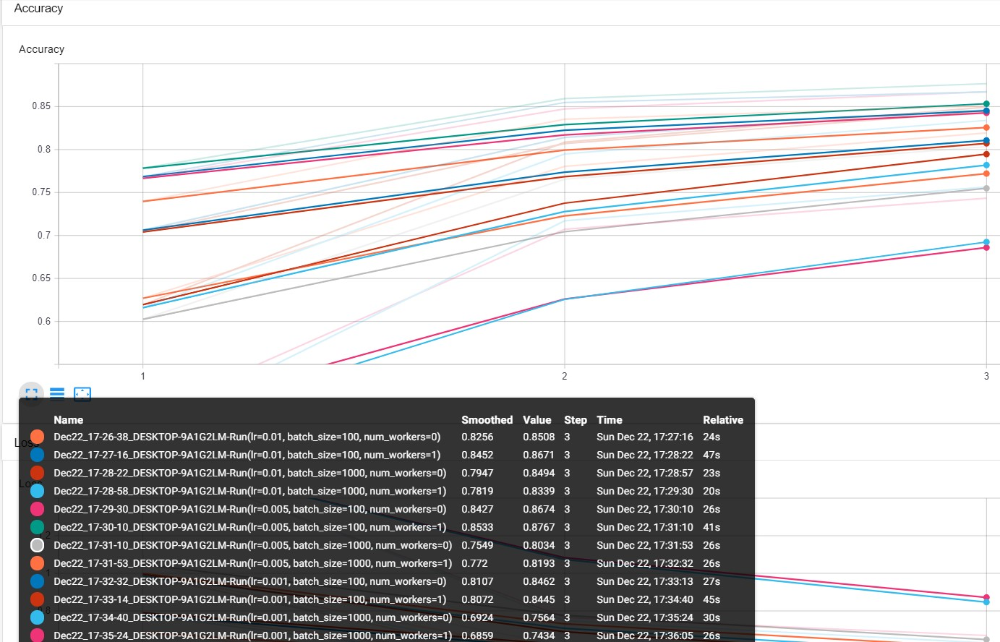
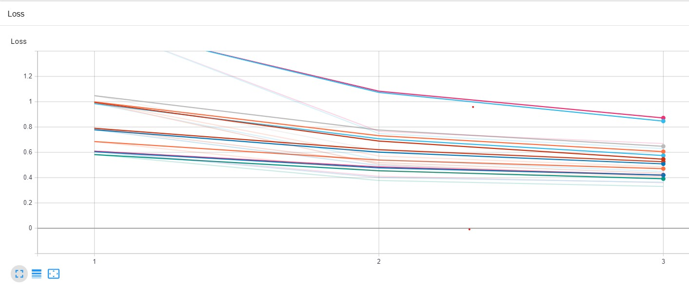
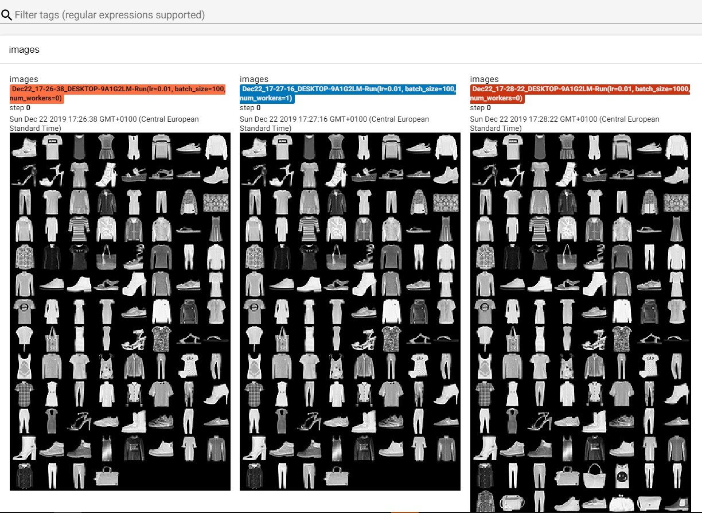
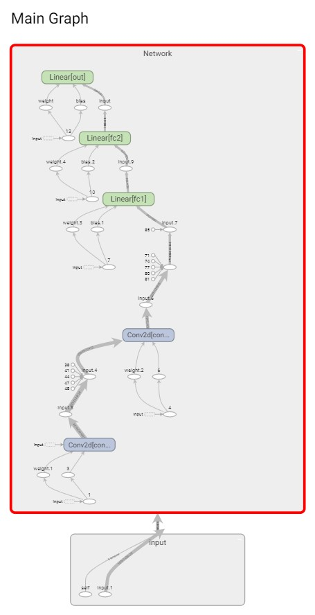
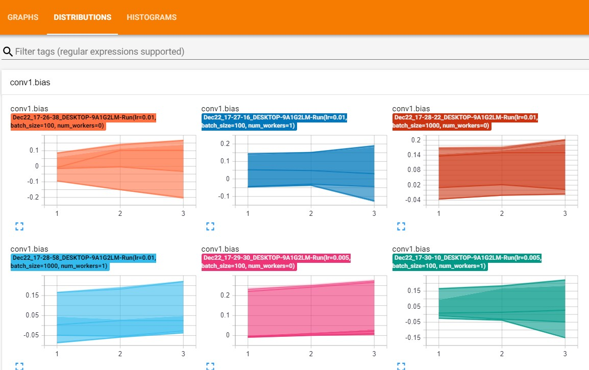
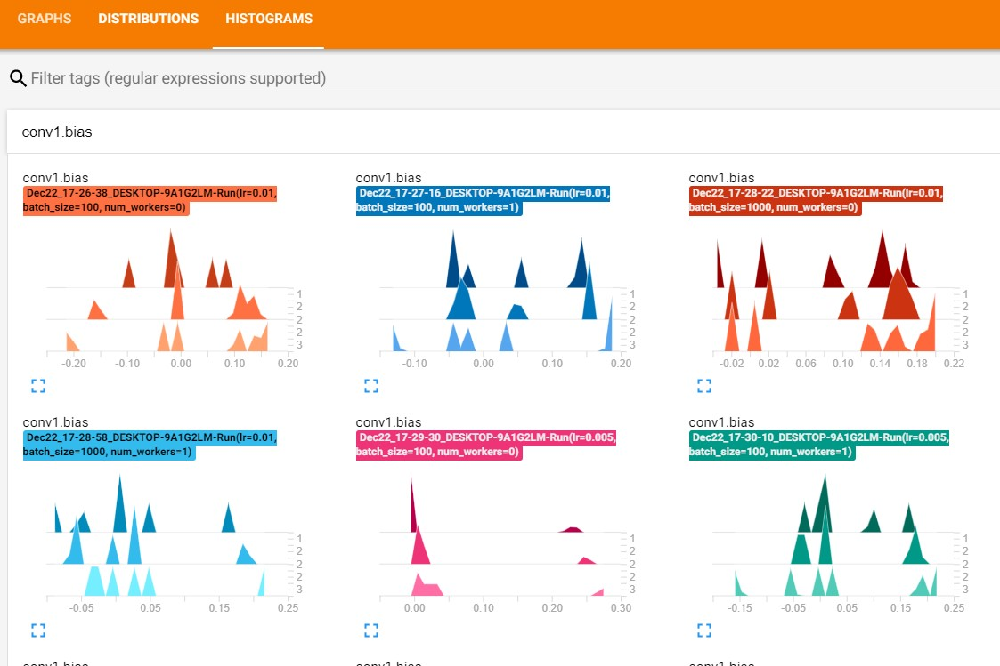

# About
This is an implementation of [Deeplizard's TensorBoard with PyTorch - Visualize Deep Learning Metrics](https://youtu.be/pSexXMdruFM) to showcase TensorBoard. With TensorBoard, we can track, analyze and visualize our training models. It is especially useful for searching a good set of hyperparameters. The dataset used in this example is the [Fashion MNIST](https://github.com/zalandoresearch/fashion-mnist) dataset from Zalando Research.

# Hyperparameter Search

Finding good hyperparameters is always a bit of a tedious task in machine learning. Let's say we have three different sets of hyperparameters we want to use for training our model:

```python
params = OrderedDict(
    lr = [0.01, 0.005, 0.001],
    batch_size = [100, 1000],
    num_workers = [0, 1]
)
```

We have 3 different learning rates [0.01, 0.005, 0.001], two batch sizes [100, 1000] and different numbers of num_workers (denotes the number of processes that generate batches in parallel). Is the set `(lr=0.01, batch_size=100, num_workers=0)` good? Or is for example the set `(lr=0.005, batch_size=1000, num_workers=1)` better? Taking the cartesian product of these sets equals to 12 different combination of hyperparameters. We could conduct 12 separate training sessions and compare their performances afterwards. Or we could include all 12 possible sets of hyperparameters in a single training loop and compare them in TensorBoard afterwards. Let's do the later.

# RunManager.py

1. [Install TensorBoard](https://pytorch.org/docs/stable/tensorboard.html) so we can use TensorBoard's SummaryWriter function:
```python
from torch.utils.tensorboard import SummaryWriter
```
2. `RunManager.py` helps us in multiple ways.

    1. The two classes in that file (`RunManager` and `RunBuilder`) save all kinds of information for us, like accuracy and loss per epoch/run, information about our network, duration per epoch etc... all information that we can visualize later in TensorBoard. Another useful method `def save(self, fileName):` gives us another possibility to save our results in `.json` or `.csv` respectively.
    
    2. "Outsourcing" the saving of information to a different file helps to keep the training loop itself clear and easy to track.


We initialize our parameters and the RunManager() before the training loop.

```python

params = OrderedDict(
    lr = [0.01, 0.005, 0.001],
    batch_size = [100, 1000],
    num_workers = [0, 1]
    #shuffle = [True, False]
)

m = RunManager()

for run in RunBuilder.get_runs(params):
    
    network = Network()
    loader = DataLoader(train_set, batch_size=run.batch_size, num_workers=run.num_workers)
    optimizer = optim.Adam(network.parameters(), lr=run.lr)
    
    m.begin_run(run, network, loader)
    for epoch in range(3):
        m.begin_epoch()
        
        ...
 ```
        
 # Training: Step-by-Step
 
 1. Adjust the hyperparameters you want to use in (`params = OrderedDict`) in `train.py`
 
 2. Run the file with 
 ```python
 python train.py
 ```
 
 3. This will generate the following files:
    * A .json file with all the results (`results.json`).
    * A .csv file with all the results (`results.csv`).
    * A `runs` folder where the results are saved in a format that TensorBoard can use.
    
  4. After installing tensorboard, navigate to the folder repository and type in a terminal:
  ```
  tensorboard --logdir=runs
  ```
  5. The command will give you an output like `http://localhost:6006/` (or similar) and copy that in your web browser.
  
  
 # TensorBoard Visualization
 1. Overview of our accuracy and losses of all (12) training instances / different hyperparameter settings. We can see track the accuracy, number of steps (epoch), time and duration of each instance. We can see that (the dark green) instance with the hyperparameter set `lr=0.005, batch_size=100, num_workers=1` has the highest accuracy, however it takes slightly longer than the other instances to finish with `41s`.
 
 
 
 Same goes for the losses:
 
 
 
 2. Take a look at our training examples.
 
 
 
 3. Take a look at our network / graph.
 
 
 
 4. Distribition and histograms of our network weights.
 
 
 
 
 
 All in all, a very useful tool to track our training process.
 
 


